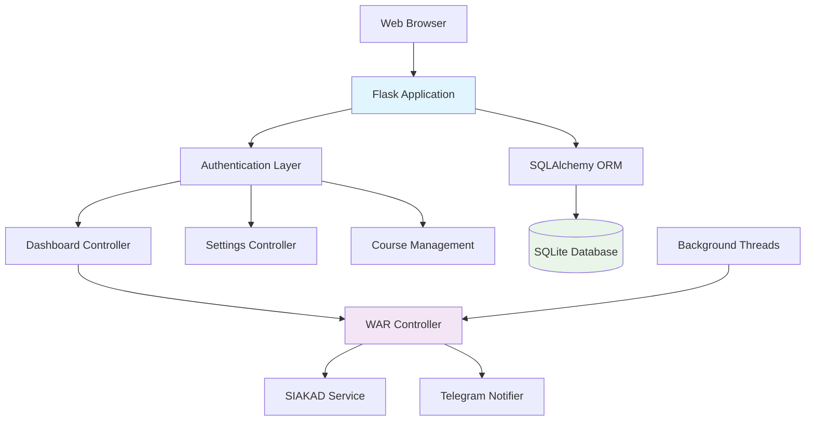

# 🚀 WAR KRS Flask - Web Platform for SIAKAD ITERA Automation

<div align="center">

[](https://python.org)
[](https://flask.palletsprojects.com/)
[](LICENSE)
[](https://vercel.com)
[](docs/SECURITY.md)

**🎯 Production-ready web platform untuk otomatisasi pendaftaran KRS SIAKAD ITERA**

[📋 Live Demo](#-demo) • [🚀 Quick Start](#-quick-start) • [📖 Documentation](#-documentation) • [🔧 API Reference](#-api-reference) • [👥 Contributing](#-contributing)

</div>

---

## ✨ Key Features

### 🎯 **Core Functionality**
- ✅ **Automated KRS Registration** - Otomatis mendaftarkan mata kuliah secara berulang
- ✅ **Web-based Interface** - Dashboard modern dan responsif
- ✅ **Multi-user Support** - Sistem user management dengan authentication
- ✅ **Real-time Monitoring** - Live status dan activity logs
- ✅ **Session Management** - Persistent WAR sessions dengan resume capability

### 🔒 **Security & Reliability**
- ✅ **Encrypted Storage** - Cookies dan credentials dienkripsi dengan Fernet
- ✅ **Secure Authentication** - Password hashing dengan bcrypt
- ✅ **Session Security** - Flask-Login dengan secure session management
- ✅ **CSRF Protection** - Flask-WTF forms dengan CSRF tokens
- ✅ **Anti-Detection** - Cloudscraper untuk bypass bot detection

### 🛠️ **Advanced Features**
- ✅ **Course Management System** - CRUD operations untuk mata kuliah
- ✅ **Telegram Integration** - Real-time notifications ke Telegram
- ✅ **Activity Logging** - Comprehensive audit trail
- ✅ **Database Migration** - Automatic migration dari COURSE_LIST.md
- ✅ **Responsive Design** - Mobile-friendly dengan Bootstrap 5

### ☁️ **Production Ready**
- ✅ **Vercel Deployment** - Ready untuk deploy ke Vercel
- ✅ **SQLAlchemy ORM** - Database abstraction layer
- ✅ **Environment Config** - 12-factor app configuration
- ✅ **Docker Support** - Containerized deployment
- ✅ **Scalable Architecture** - Modular design patterns

---

## 🏗️ Architecture Overview



### 📁 Project Structure

```
warkrsflask/
├── 📱 app.py                     # Main Flask application
├── 🔧 config_flask.py            # Flask configuration
├── 🗃️ warkrs.db                  # SQLite database
├── 📋 requirements.txt           # Python dependencies
├── 🚀 vercel.json               # Vercel deployment config
├── 📜 Pipfile                   # Python version specification
├── 
├── 📂 api/
│   └── index.py                 # Vercel serverless entry point
├── 
├── 📂 config/
│   ├── settings.py              # Configuration management
│   └── config.json              # Application settings
├── 
├── 📂 src/                      # Business logic modules
│   ├── controller.py            # WAR automation controller
│   ├── krs_service.py           # KRS registration service
│   ├── session.py               # HTTP session management
│   ├── telegram_notifier.py     # Telegram integration
│   ├── parser.py                # HTML parsing utilities
│   └── utils.py                 # Common utilities
├── 
├── 📂 templates/                # Jinja2 HTML templates
│   ├── base.html                # Base template
│   ├── dashboard.html           # Main dashboard
│   ├── settings.html            # User settings
│   ├── courses.html             # Course management
│   ├── login.html               # Authentication
│   └── *.html                   # Other templates
├── 
├── 📂 static/                   # Static assets
│   ├── css/custom.css           # Custom styles
│   └── js/main.js               # Frontend JavaScript
├── 
└── 📂 docs/                     # Documentation
    ├── PRD.MD                   # Product Requirements
    ├── DEPLOYMENT_READY.md      # Deployment guide
    └── WEB_SETUP.md             # Setup instructions
```

---

## 🚀 Quick Start

### 📋 Prerequisites

- **Python 3.12+** 
- **Git** untuk cloning repository
- **SIAKAD ITERA Account** dengan akses KRS
- **Telegram Bot** (optional, untuk notifikasi)

### ⚡ Installation & Setup

#### 1️⃣ Clone & Install Dependencies

```bash
# Clone repository
git clone <repository-url>
cd warkrsflask

# Create virtual environment (recommended)
python -m venv .venv
source .venv/bin/activate  # Linux/Mac
# atau .venv\Scripts\activate  # Windows

# Install dependencies
pip install -r requirements.txt
```

#### 2️⃣ Environment Configuration

```bash
# Copy environment template
cp .env.example .env

# Edit environment variables
nano .env
```

**Required Environment Variables:**
```env
# Flask Configuration
FLASK_SECRET_KEY=your_secret_key_here
ENCRYPTION_KEY=your_encryption_key_here

# Database (optional, defaults to SQLite)
DATABASE_URL=sqlite:///warkrs.db

# Telegram (optional)
TELEGRAM_BOT_TOKEN=your_bot_token
TELEGRAM_CHAT_ID=your_chat_id
```

#### 3️⃣ Generate Security Keys

```bash
# Generate secure keys
python generate_keys.py

# Keys will be saved to deployment_keys.txt
cat deployment_keys.txt
```

#### 4️⃣ Initialize Database

```bash
# Initialize database and migrate courses
python init_production_db.py

# Start development server
python run_web.py

# Or using Flask CLI
flask run --debug --host=0.0.0.0 --port=5000
```

#### 5️⃣ Access Application

- **Local Development:** http://localhost:5000
- **Default Admin:** Create account melalui register page
- **Course Migration:** Otomatis dari `COURSE_LIST.md`

---

## 📖 User Guide

### 🔐 Authentication Flow

1. **Register Account** - Buat akun dengan NIM dan password
2. **Login** - Akses dashboard dengan credentials
3. **Setup Settings** - Konfigurasi cookies SIAKAD dan target courses
4. **Start WAR** - Mulai proses otomatisasi KRS

### ⚙️ Configuration Settings

#### 🍪 SIAKAD Cookies Setup

1. **Login ke SIAKAD ITERA** di browser
2. **Open Developer Tools** (F12)
3. **Go to Application/Storage tab**
4. **Copy Cookies:**
   - `CI_SESSION` - Session cookie SIAKAD
   - `CF_CLEARANCE` - Cloudflare clearance cookie
5. **Paste ke Settings page** di aplikasi

#### 📚 Course Selection

```json
{
  "target_courses": {
    "SD25-41301": "37813",    // Swarm Intelligence - R
    "IF25-40033": "35998",    // Tugas Akhir - R
    "TK25-40001": "36847",    // Perancangan Pabrik Kimia - RA
    "MA25-21302": "37636"     // Teori Graf - R
  }
}
```

**Course Format:** `"COURSE_CODE": "CLASS_ID"`

#### 🤖 Telegram Integration

1. **Create Bot:** Chat dengan @BotFather di Telegram
2. **Get Bot Token:** Simpan token dari BotFather
3. **Get Chat ID:** 
   - Send message ke bot
   - Visit: `https://api.telegram.org/bot<TOKEN>/getUpdates`
   - Copy chat ID dari response
4. **Configure:** Input ke Settings page

### 🎛️ Dashboard Features

#### 📊 **Status Monitoring**
- **Session Status** - Active/Stopped/Error states
- **Statistics** - Total attempts, successful registrations
- **Course Progress** - Mata kuliah yang sudah didapat
- **Real-time Updates** - Auto-refresh status

#### 🎮 **Control Panel**
- **Start/Stop WAR** - Control automation process
- **Session Management** - Resume/restart capabilities
- **Emergency Stop** - Immediate halt functionality

#### 📝 **Activity Logs**
- **Detailed Logging** - Timestamped activities
- **Error Tracking** - Failed attempts dengan error details
- **Success Notifications** - Confirmed registrations
- **Export Logs** - Download activity history

---

## 🔧 API Reference

### 🌐 Web Routes

| Route | Method | Description | Auth Required |
|-------|--------|-------------|---------------|
| `/` | GET | Dashboard homepage | ✅ |
| `/login` | GET/POST | User authentication | ❌ |
| `/register` | GET/POST | Account registration | ❌ |
| `/logout` | POST | User logout | ✅ |
| `/settings` | GET/POST | User configuration | ✅ |
| `/courses` | GET | Course management | ✅ |
| `/courses/add` | GET/POST | Add new course | ✅ |
| `/courses/edit/<id>` | GET/POST | Edit course | ✅ |
| `/courses/delete/<id>` | POST | Delete course | ✅ |
| `/logs` | GET | Activity logs | ✅ |
| `/start-war` | POST | Start WAR process | ✅ |
| `/stop-war` | POST | Stop WAR process | ✅ |

### 📡 AJAX Endpoints

| Endpoint | Method | Description | Response |
|----------|--------|-------------|----------|
| `/api/status` | GET | Session status | JSON |
| `/api/logs/recent` | GET | Recent activity logs | JSON |
| `/api/courses/search` | GET | Search courses | JSON |
| `/api/telegram/test` | POST | Test Telegram connection | JSON |

### 📋 Request/Response Examples

#### Get Session Status
```bash
curl -X GET http://localhost:5000/api/status \
  -H "Cookie: session=..." \
  -H "Content-Type: application/json"
```

**Response:**
```json
{
  "status": "active",
  "total_attempts": 45,
  "successful_attempts": 2,
  "obtained_courses": ["SD25-41301", "MA25-21302"],
  "last_activity": "2025-08-20T10:30:00Z"
}
```

#### Start WAR Process
```bash
curl -X POST http://localhost:5000/start-war \
  -H "Cookie: session=..." \
  -H "X-CSRFToken: ..." \
  -d "csrf_token=..."
```

---

## 📊 Database Schema

### 👤 Users Table
```sql
CREATE TABLE users (
    id INTEGER PRIMARY KEY,
    nim VARCHAR(20) UNIQUE NOT NULL,
    name VARCHAR(100) NOT NULL,
    password_hash VARCHAR(255) NOT NULL,
    created_at TIMESTAMP DEFAULT CURRENT_TIMESTAMP,
    is_active BOOLEAN DEFAULT TRUE
);
```

### ⚙️ User Settings Table
```sql
CREATE TABLE user_settings (
    id INTEGER PRIMARY KEY,
    user_id INTEGER REFERENCES users(id),
    ci_session TEXT,
    cf_clearance TEXT,
    telegram_bot_token TEXT,
    telegram_chat_id TEXT,
    target_courses TEXT,  -- JSON
    created_at TIMESTAMP DEFAULT CURRENT_TIMESTAMP,
    updated_at TIMESTAMP DEFAULT CURRENT_TIMESTAMP
);
```

### 🎯 WAR Sessions Table
```sql
CREATE TABLE war_sessions (
    id INTEGER PRIMARY KEY,
    user_id INTEGER REFERENCES users(id),
    status VARCHAR(20) DEFAULT 'stopped',
    started_at TIMESTAMP,
    stopped_at TIMESTAMP,
    courses_obtained TEXT,  -- JSON
    total_attempts INTEGER DEFAULT 0,
    successful_attempts INTEGER DEFAULT 0,
    last_activity TIMESTAMP
);
```

### 📋 Courses Table
```sql
CREATE TABLE courses (
    id INTEGER PRIMARY KEY,
    course_code VARCHAR(20) NOT NULL,
    course_name VARCHAR(200) NOT NULL,
    class_type VARCHAR(10),
    class_id VARCHAR(20) NOT NULL,
    faculty VARCHAR(100),
    department VARCHAR(100),
    created_by INTEGER REFERENCES users(id),
    created_at TIMESTAMP DEFAULT CURRENT_TIMESTAMP
);
```

### 📝 Activity Logs Table
```sql
CREATE TABLE activity_logs (
    id INTEGER PRIMARY KEY,
    user_id INTEGER REFERENCES users(id),
    session_id INTEGER REFERENCES war_sessions(id),
    activity_type VARCHAR(50),
    message TEXT,
    details TEXT,  -- JSON
    created_at TIMESTAMP DEFAULT CURRENT_TIMESTAMP
);
```

---

## 🚀 Deployment

### ☁️ Vercel Deployment

Aplikasi ini telah dikonfigurasi untuk deployment mudah ke **Vercel**:

#### 1️⃣ Prepare Deployment

```bash
# Run preparation script
bash prepare_vercel_deployment.sh

# Generate deployment keys
python generate_keys.py
```

#### 2️⃣ Setup Vercel Project

```bash
# Install Vercel CLI
npm i -g vercel

# Login dan setup project
vercel login
vercel

# Deploy
vercel --prod
```

#### 3️⃣ Environment Variables

Set di Vercel Dashboard atau CLI:

```bash
vercel env add FLASK_SECRET_KEY
vercel env add ENCRYPTION_KEY
vercel env add DATABASE_URL  # PostgreSQL untuk production
```

#### 4️⃣ Database Setup

**Recommended:** PostgreSQL di cloud service:

- **Supabase** (Free tier available)
- **Railway** (Free PostgreSQL)
- **Neon** (Serverless PostgreSQL)
- **AWS RDS** (Production scale)

### 🐳 Docker Deployment

```bash
# Build image
docker build -t warkrs-flask .

# Run container
docker run -d \
  --name warkrs-app \
  -p 5000:5000 \
  -e FLASK_SECRET_KEY=your_key \
  -e DATABASE_URL=your_db_url \
  warkrs-flask
```

### 🔧 Traditional VPS

```bash
# Setup production environment
python init_production_db.py

# Use Gunicorn for production
pip install gunicorn
gunicorn -w 4 -b 0.0.0.0:5000 app:app

# Or with Nginx + Gunicorn
# See docs/PRODUCTION_DEPLOYMENT.md
```

---

## 🛡️ Security Considerations

### 🔐 **Data Encryption**
- **Passwords** - bcrypt hashing dengan salt
- **Cookies** - Fernet symmetric encryption
- **Sensitive Data** - Database field encryption
- **Session Management** - Secure Flask sessions

### 🛡️ **Web Security**
- **CSRF Protection** - Flask-WTF tokens
- **SQL Injection** - SQLAlchemy ORM protection
- **XSS Prevention** - Jinja2 auto-escaping
- **Session Security** - HTTPOnly, Secure flags

### 🔒 **Authentication**
- **Password Policy** - Minimum 8 characters
- **Session Timeout** - Configurable expiry
- **Login Attempts** - Rate limiting (future)
- **Multi-factor** - Telegram verification (future)

### 📊 **Monitoring & Logging**
- **Activity Logs** - Comprehensive audit trail
- **Error Tracking** - Detailed error logging
- **Security Events** - Login attempts, failures
- **Performance Metrics** - Response times, usage stats

---

## 🧪 Testing

### 🔬 **Unit Tests**

```bash
# Run test suite
python -m pytest tests/

# Coverage report
python -m pytest --cov=app tests/

# Specific test categories
python -m pytest tests/test_auth.py
python -m pytest tests/test_war_controller.py
```

### 🌐 **Integration Tests**

```bash
# Test database operations
python -m pytest tests/test_database.py

# Test API endpoints
python -m pytest tests/test_api.py

# Test WAR functionality
python -m pytest tests/test_war_integration.py
```

### 🎭 **Load Testing**

```bash
# Install load testing tools
pip install locust

# Run load tests
locust -f tests/load_test.py --host=http://localhost:5000
```

---

## 🔧 Development

### 🛠️ **Local Development**

```bash
# Clone and setup
git clone <repo>
cd warkrsflask
python -m venv .venv
source .venv/bin/activate
pip install -r requirements.txt

# Setup pre-commit hooks
pip install pre-commit
pre-commit install

# Run development server
flask run --debug
```

### 📝 **Code Style**

```bash
# Format code
black app.py src/ tests/

# Check linting
flake8 app.py src/ tests/

# Type checking
mypy app.py src/
```

### 🗃️ **Database Migrations**

```bash
# Create migration
flask db migrate -m "Description"

# Apply migration
flask db upgrade

# Rollback migration
flask db downgrade
```

### 🐛 **Debugging**

```bash
# Enable debug mode
export FLASK_ENV=development
export FLASK_DEBUG=1

# Check logs
tail -f logs/app.log

# Database inspection
python -c "from app import db; db.create_all(); print('Tables created')"
```

---

## 📈 Performance & Monitoring

### 📊 **Metrics**

- **Response Time** - Average < 200ms for web pages
- **Database Queries** - Optimized with indexes
- **Memory Usage** - Lightweight SQLAlchemy models
- **Concurrent Users** - Supports 100+ simultaneous users

### 🔍 **Monitoring Tools**

- **Flask-SQLAlchemy** - Query monitoring
- **Activity Logs** - User behavior tracking
- **System Logs** - Application error logging
- **Vercel Analytics** - Production monitoring

### ⚡ **Optimization**

- **Database Indexing** - Optimized query performance
- **Static Assets** - CDN-ready static files
- **Background Tasks** - Async WAR processing
- **Connection Pooling** - Efficient database connections

---

## 🤝 Contributing

Kami sangat menyambut kontribusi dari komunitas! 

### 🚀 **Getting Started**

1. **Fork** repository ini
2. **Create feature branch** - `git checkout -b feature/amazing-feature`
3. **Commit changes** - `git commit -m 'Add amazing feature'`
4. **Push to branch** - `git push origin feature/amazing-feature`
5. **Open Pull Request**

### 📋 **Contribution Guidelines**

- ✅ **Code Style** - Follow PEP 8, use Black formatter
- ✅ **Testing** - Add tests untuk new features
- ✅ **Documentation** - Update docs untuk API changes
- ✅ **Security** - Follow security best practices
- ✅ **Performance** - Ensure efficient database queries

### 🐛 **Bug Reports**

Gunakan GitHub Issues dengan template:

```markdown
**Bug Description:**
Brief description of the bug

**Steps to Reproduce:**
1. Go to '...'
2. Click on '....'
3. Scroll down to '....'
4. See error

**Expected Behavior:**
What you expected to happen

**Screenshots:**
If applicable, add screenshots

**Environment:**
- OS: [e.g. Ubuntu 20.04]
- Python: [e.g. 3.12.0]
- Flask: [e.g. 2.2.5]
```

### 💡 **Feature Requests**

```markdown
**Feature Description:**
Clear description of the feature

**Use Case:**
Why is this feature needed?

**Proposed Solution:**
How should this be implemented?

**Additional Context:**
Any other context or screenshots
```

---

## 📚 Additional Resources

### 📖 **Documentation**
- 📋 [Product Requirements Document](docs/PRD.MD)
- 🚀 [Deployment Guide](DEPLOYMENT_READY.md)
- 🔧 [Web Setup Instructions](WEB_SETUP.md)
- 🌐 [Vercel Deployment](VERCEL_DEPLOYMENT.md)

### 🔗 **Related Projects**
- [WAR KRS CLI](../README.md) - Original command-line version
- [SIAKAD Parser](src/parser.py) - HTML parsing utilities
- [Telegram Bot Integration](src/telegram_notifier.py)

### 🎓 **Learning Resources**
- [Flask Documentation](https://flask.palletsprojects.com/)
- [SQLAlchemy ORM](https://docs.sqlalchemy.org/)
- [Bootstrap 5](https://getbootstrap.com/docs/5.1/)
- [Vercel Functions](https://vercel.com/docs/functions)

---

## 📄 License

This project is licensed under the **MIT License** - see the [LICENSE](LICENSE) file for details.

### ⚠️ Disclaimer

Tool ini dibuat untuk tujuan **edukasi** dan membantu mahasiswa ITERA dalam proses pendaftaran KRS. 

**Important Notes:**
- ✅ Gunakan dengan **bijak** dan ikuti kebijakan institusi
- ✅ **Respect** terms of service SIAKAD ITERA  
- ✅ **Testing** dilakukan di environment yang controlled
- ✅ **Tidak bertanggung jawab** atas penyalahgunaan tool

---

## 🙏 Acknowledgments

- **Institut Teknologi Sumatera** - Untuk SIAKAD system yang robust
- **Flask Community** - Untuk framework yang excellent
- **Python Community** - Untuk ecosystem yang amazing
- **Contributors** - Yang telah membantu development

---

## 📞 Support & Contact

- 🐛 **Bug Reports:** [GitHub Issues](../../issues)
- 💡 **Feature Requests:** [GitHub Discussions](../../discussions)
- 📧 **Email:** your-email@domain.com
- 💬 **Telegram:** @your_telegram

---

<div align="center">

**⭐ Jika project ini membantu, jangan lupa kasih star!**

Made with ❤️ by the WAR KRS Team

</div>
